import CollapsibleAnswer from '@site/src/components/CollapsibleAnswer';
import DeepDive from '@site/src/components/DeepDive';
import ImageCard from '@site/src/components/ImageCard';
import ChatBaseBubble from "@site/src/components/ChatBaseBubble";


# Agentic AI Coding Tool

This handout will provide instruction on how you can setup an Agentic AI Coding tool to do your Exercise 3 in both Mini Projects 1 and 2. NOTE: We must do Exercise 1 and 2 on your own without any AI Coding tool. This handout is to help you to get exposure to Agentic AI Coding tools and yet at the same time, you will benefit more in using any AI tool if you have a strong foundation.

In this course we will use [OpenCode](https://opencode.ai) with [Github Copilot Education](https://github.com/features/copilot) for AI token access.

This exercise using AI Coding Tool is optional and you are free to complete Exercise 3 without any AI Coding tool.

## Getting Started

### Getting Github Education Account

1. You need to create a GitHub account at [https://github.com](https://github.com) using your **SUTD email address**.
1. Apply for **student application** at [Github Education](https://github.com/settings/education/benefits).

<iframe src="https://sutdapac-my.sharepoint.com/personal/oka_kurniawan_sutd_edu_sg/_layouts/15/embed.aspx?UniqueId=159fa72c-0d01-46ee-8922-c6687b9d04dc&embed=%7B%22ust%22%3Afalse%2C%22hv%22%3A%22CopyEmbedCode%22%7D&referrer=StreamWebApp&referrerScenario=EmbedDialog.Create" width="640" height="360" frameborder="0" scrolling="no" allowfullscreen title="Applying for GitHub Education Account.webm"></iframe>

As of early 2026, GitHub has transitioned its Education benefits into a more structured tier system. While students still receive a version of Copilot Pro for free, the usage limits are now governed by a "metered" resource model rather than being entirely unlimited.

Here is the breakdown of the limits for the GitHub Copilot Student plan:

#### Premium Request Quotas

The most significant "token-like" limit is on Premium Requests. These are consumed when you use top-tier AI models (like Claude 3.7/4.5, GPT-5.3 Codex, or Gemini 3 Pro) for chat, agent tasks, or complex reasoning.

Monthly Allowance: 300 Premium Requests per month.

Reset Cycle: Your quota resets on the 1st of every month, regardless of when you signed up.

Failover Protocol: If you hit this 300-request limit, GitHub doesn't cut you off entirely. Instead, it automatically switches your session to a "Standard" model (typically GPT-4.1 or similar), which provides unlimited usage but with a shorter context window and reduced reasoning capability.

#### Rate Limits (RPM/RPH)

To ensure service stability, there are also "velocity" limits on how fast you can send requests:

Requests Per Minute (RPM): Approximately 50-100 RPM depending on the model and current server load.

Requests Per Hour (RPH): Generally capped around 1,000 RPH.

#### How to Check Your Usage

You can monitor your remaining "tokens" (requests) directly within your IDE:

VS Code: Click the Copilot Icon in the bottom-right status bar. A "Copilot Usage" box will appear showing how many premium requests you have left for the month.

GitHub Settings: You can also view this under Settings > Billing and plans > Plans and usage on the GitHub website.

### Installing OpenCode

You have two choices to install OpenCode:

* OpenCode Terminal (for the brave)
* OpenCode Desktop (Beta)

Your instructors use OpenCode Terminal to test everything, but we understand that not everyone is comfortable with Terminal or CLI. Feel free to use the OpenCode Desktop (Beta) if you are more comfortable to use GUI based application. The following instruction is for most student and so we will provide steps for OpenCode Desktop. If you choose to install the Terminal version, follow [the instruction to get started](https://opencode.ai/docs).

1. Download [OpenCode **Desktop** (Beta)](https://opencode.ai/download). 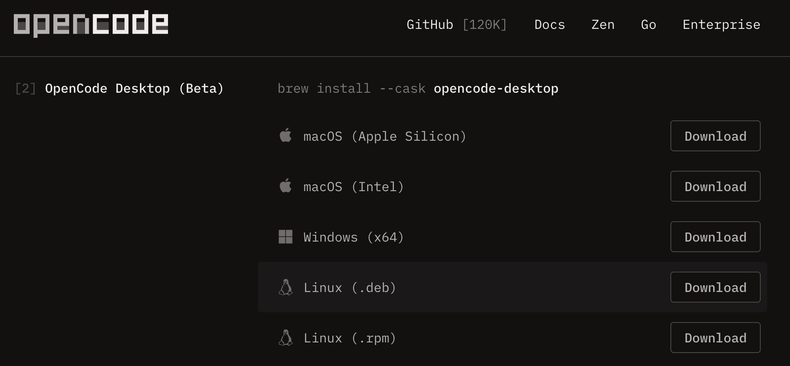
1. Run the installer.

### Connecting OpenCode with Github Copilot

1. Go to OpenCode Settings. 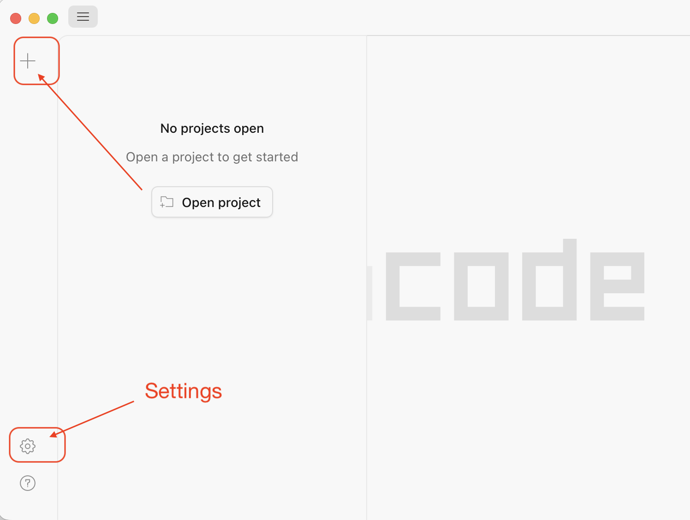
1. Under "Server" click "Providers". 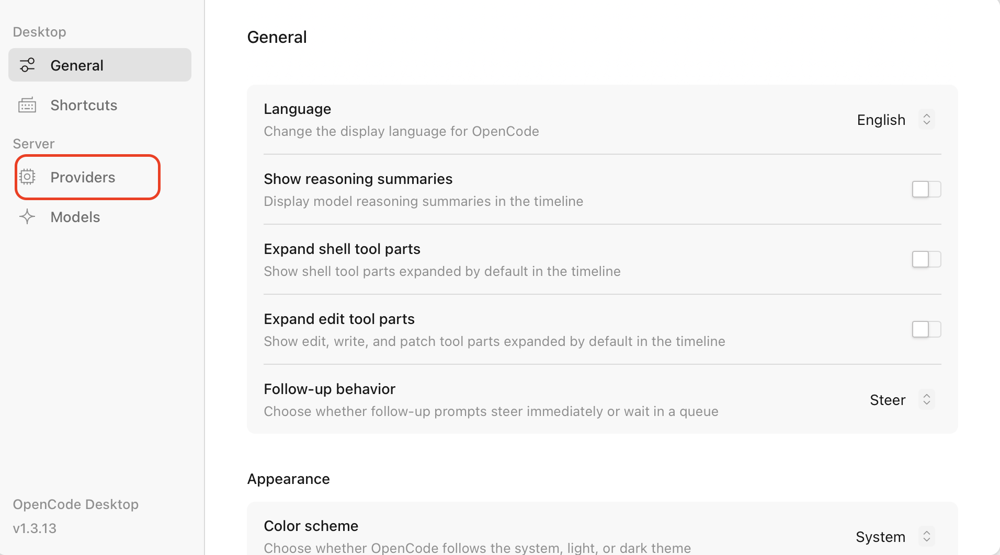
1. Under "Popular providers" find "GitHub Copilot" and click "Connect". 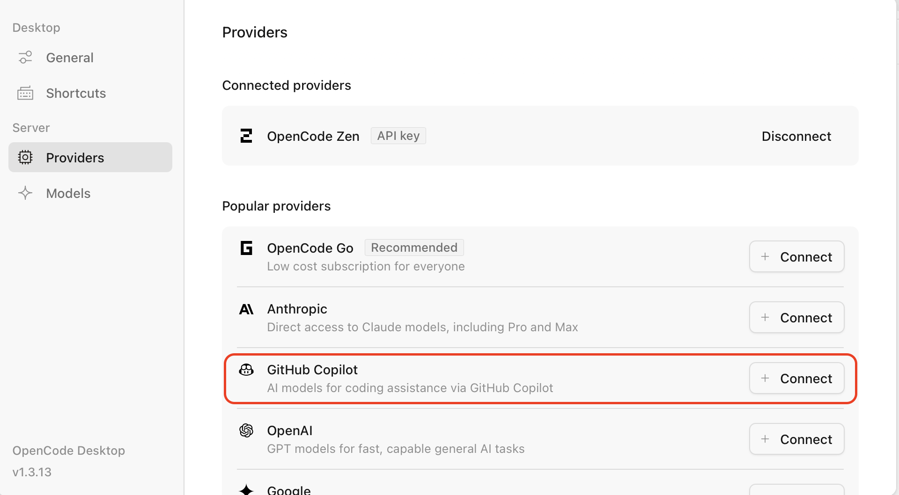
1. Click the link to open the Github site to allow connection with OpenCode. You will need to enter the code provided by OpenCode into the GitHub page and click "Allow". 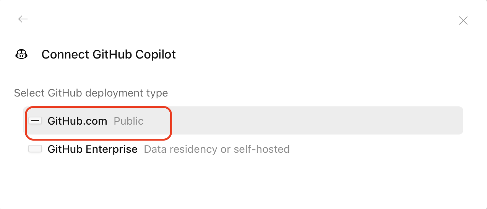 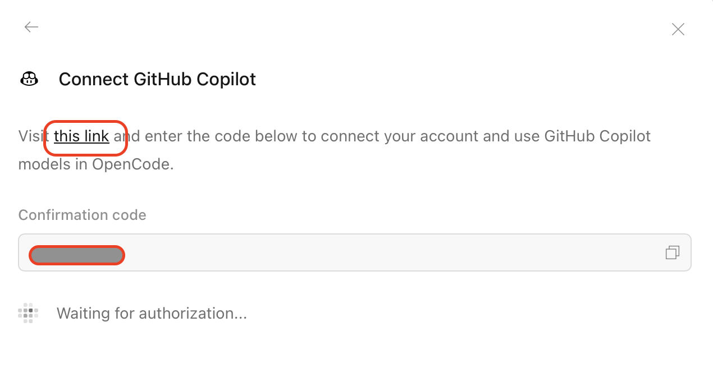 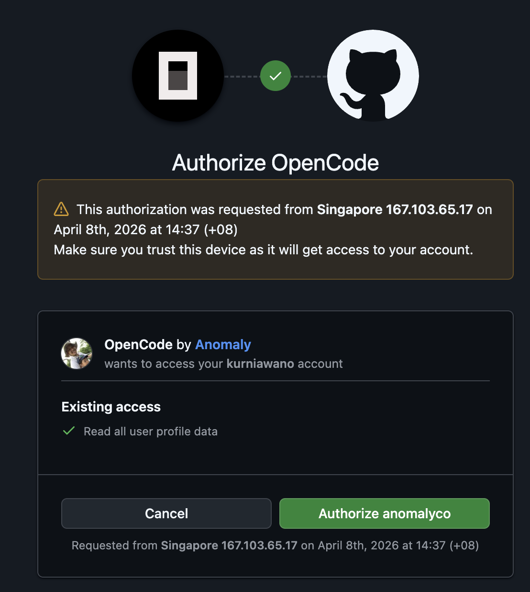
1. Once you are connected, click "Model" option at the bottom and search for "Github Copilot", choose one of the model such as `Claude Haiku 4.5`. 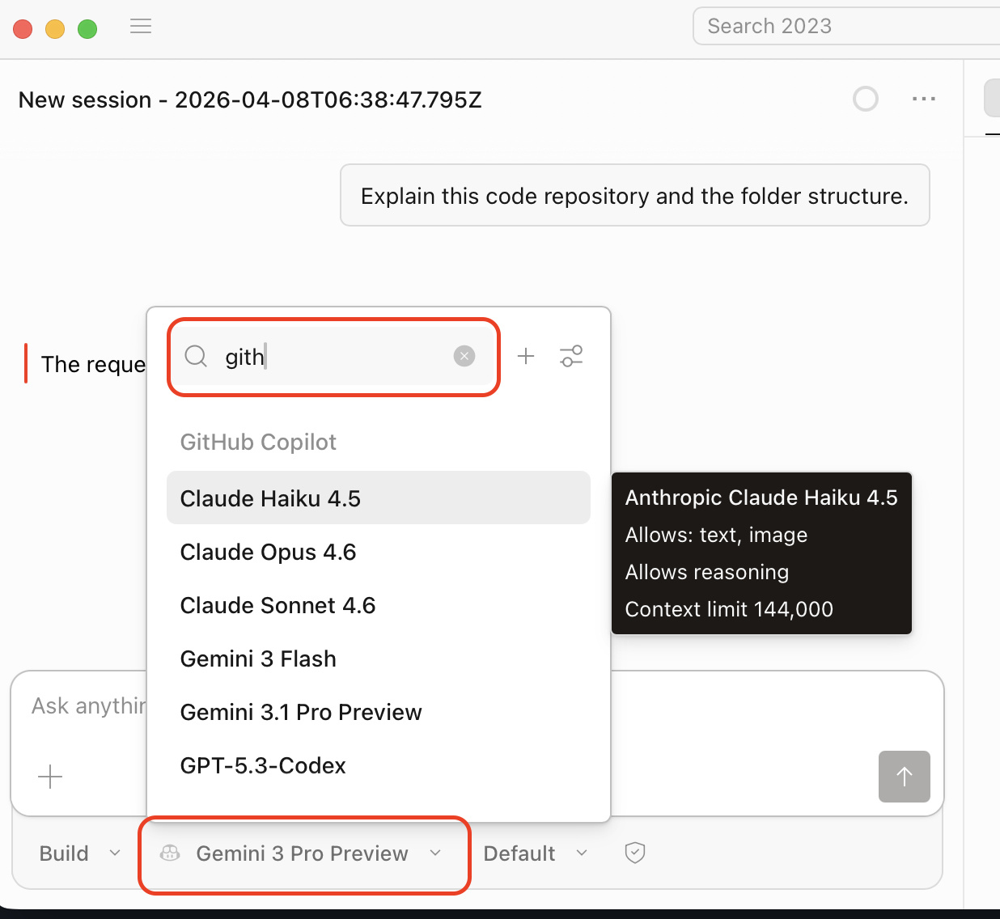

### Starting OpenCode on a Project

1. First, you will need to accept the Github classroom assignment from your eDimension. This will create a private GitHub repository for the mini project.
1. Once you have the mini project repository, you can download that project to your local computer by cloning it using Github CLI or Github Desktop app. You can also choose to download the Zip file.
1. Run OpenCode Desktop and Open the Project location. 
1. On the chat input type `/init` and press ENTER. This will create a file `AGENTS.md` that can be used for future work by the AI agent.
1. You can start exploring the project by entering the following prompt: "Explain the code base and the folder structure.".

### Video to Install OpenCode and Connect to Github Copilot

<iframe src="https://sutdapac-my.sharepoint.com/personal/oka_kurniawan_sutd_edu_sg/_layouts/15/embed.aspx?UniqueId=f2523494-b7f8-4ea7-89f5-773f04922cdb&embed=%7B%22ust%22%3Afalse%2C%22hv%22%3A%22CopyEmbedCode%22%7D&referrer=StreamWebApp&referrerScenario=EmbedDialog.Create" width="640" height="360" frameborder="0" scrolling="no" allowfullscreen title="Downloading OpenCode and Connecting to Github.mp4"></iframe>

<iframe src="https://sutdapac-my.sharepoint.com/personal/oka_kurniawan_sutd_edu_sg/_layouts/15/embed.aspx?UniqueId=daf60f50-399e-42fc-8f46-6d245d687357&embed=%7B%22ust%22%3Afalse%2C%22hv%22%3A%22CopyEmbedCode%22%7D&referrer=StreamWebApp&referrerScenario=EmbedDialog.Create" width="640" height="360" frameborder="0" scrolling="no" allowfullscreen title="OpenCode Interface.mp4"></iframe>

## Mini Project 1 Exercise 3

Make sure that you have done the setup as described in the previous section. We will use Agentic AI tool, i.e. OpenCode, to generate some files for us to get started with Exercise 3. Please complete Exercise 1 and 2 on your own first without using any Agentic AI tool.

### Understanding the Project Files

If you have not done so, the first thing you want to do is to understand your code base and folder structure. You can do this by using the following prompt:

```
Explain the code base and the folder structure.
```

Read the explanation and verify with what you understand from doing Exercise 1 and 2. You can prompt for further questions to understand the project structure better and which file is doing what.

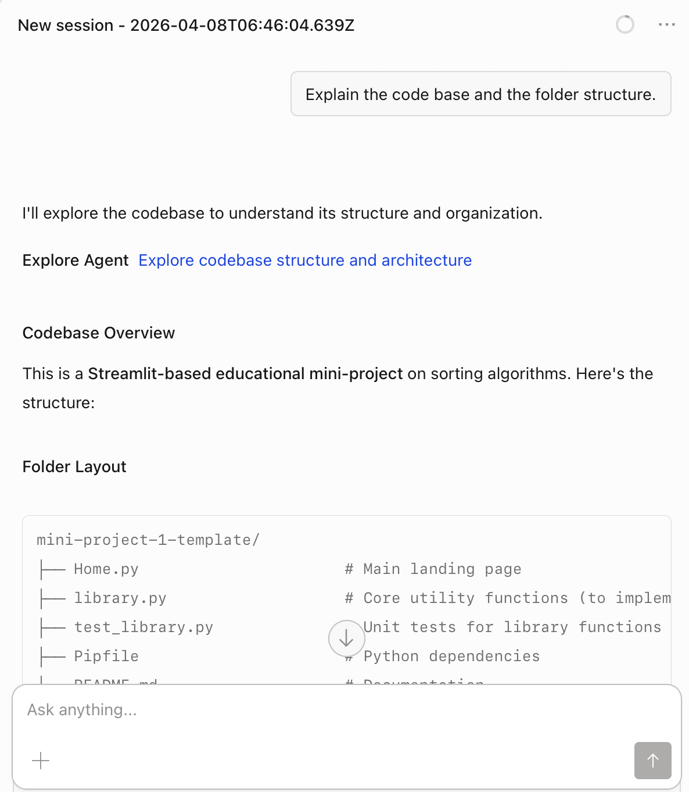

### Task 1: Creating a New File

To complete Exercise 3, you will need to create a new file. In this task, you have to figure out what the prompt should be such that it produces the following:

* It creates a new file called `3_Exercise_3.py` under the `pages` folder.
* It should have a header saying something like "Exercise 3: Open-Ended Sorting Task".
* It should import `library.py` and any function you will need to use in this task.

See some sample output in the image below.

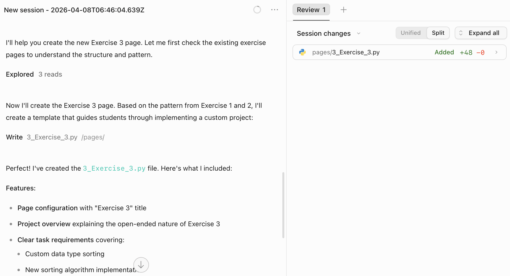
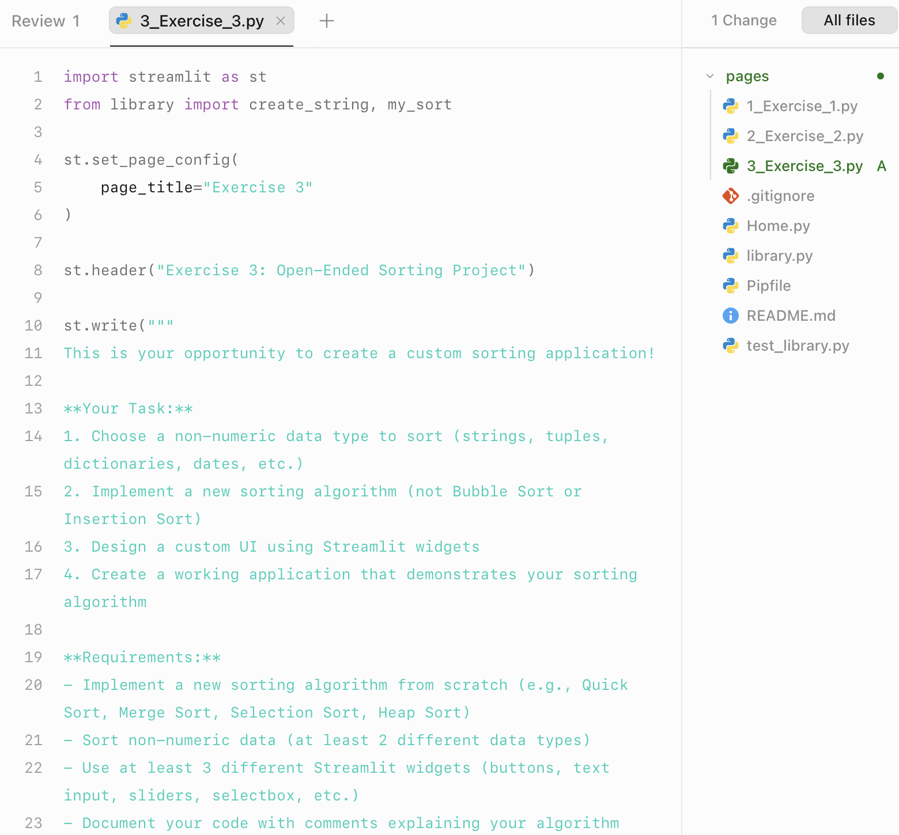

### Task 2: Create an Empty Function Header

Figure out a prompt such that it produces the following changes:

* It adds a new **empty** function in `library.py` for your custom sort algorithm.
* It imports this new function into `3_Exercise_3.py` for you to use later on.

See image below for a sample output.

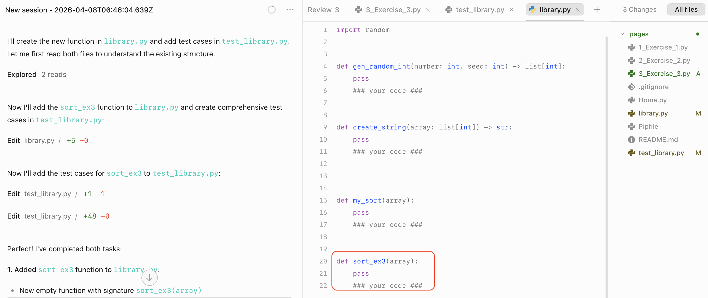

### Task 3: Generate Test Cases

Figure out a prompt such that it produces the following changes:

* It adds a comprehensive test cases for your new sort function under `test_library.py`.
* It imports your new function inside `test_library.py` and calls it inside the test cases.
* Make sure that your prompt generate the test cases based on the type of data that you have chosen for this task. 

Check the test cases generated and verify if they are accurate.

The image below shows test cases for numbers but your exercise should generate those test case for other type as well.

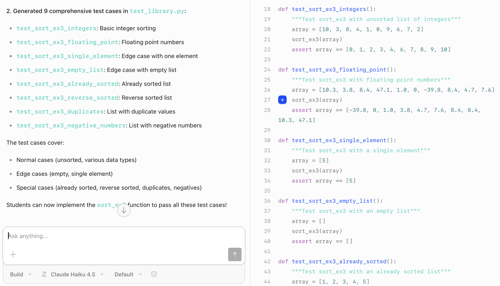

### Task 4: Execute Red-Green-Refactor Cycle

In a Test Driven Development (TDD), we follow this Red-Green-Refactor cycle. This means that we first write a test that fails (Red) and after that write an implementation that pass that test case (Green). After passing the test cases, we can refactor the code to optimise while maintaining the passing test (green-refactor).

**We strongly recommend that you implement your new sort function on your own without AI.** This way, you will understand the algorithm better during the checkoff. 

1. Run `pytest` from the root folder. This should result in the Red or failing test cases since there is no implementation yet.
1. Comment out some test cases and focus on the one test case that is simple, for example, empty list or single element test case.
1. Write down some implementation to handle this simple cases in your new sort function.
1. Run the `pytest` again to achieve the green or passing state.
1. Uncomment the other test cases that deals with number or integers  and run `pytest` to get the red or failing test cases.
1. Implement the algorithm that handles number and run `pytest` again. If your implementation is correct, this should results in the green or passing test cases.
1. Create test cases for non-number data and more complicated data type that the current sort implementation cannot handle. Run `pytest` to make sure it becomes red or failing test cases.
1. Modify the sort implementation such that it passes the more complicated data type and the number data type.

### Task 5: Creating UI in Streamlit

You can use Agentic AI tool and prompt to create input widgets and output widgets to test your new sort algorithm from the file `3_Exercise_3.py`. Explore various kinds of widget that might be more suitable for your data type by looking at [Streamlit UI docs](https://streamlit.io/components?category=all). Specify the type of Streamlit component into your prompt. 

